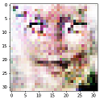
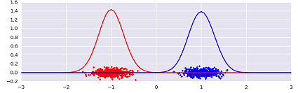
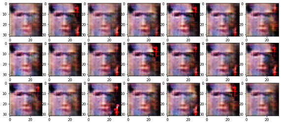

## GeneradorRostrosGAN

Resumen de los resultados que obtuve al experimentar con una red GAN.

### Que es una Redes Neuronales Generativa Adversaria (GAN)

En una red adversaria se tienen dos modelos (que pueden ser Redes Neuronales o Convolucionales) compitiendo: un Generador y un Discriminador.

Se genera un primer modelo que llamaremos Discriminador para que sea capaz de reconocer rostros humanos. Este discriminador será simplemente un clasificador, que buscara indicar si una imagen es real o falsa

Se genera un segundo modelo, que llamaremos Generador y nuestro objetivo es entrenarlo para que sea capaz de tomar una entrada aleatoria y a la salida generar algo muy parecido a una imagen de un rostro.

La idea es entrenar esos dos modelos simultáneamente buscando que al final sea el Generador el vencedor en esta competencia. 

La idea del entrenamiento es la siguiente:

    1. “Descongelar” los coeficientes del Discriminador
    2. Entrenar solo el Discriminador con imágenes falsas y reales
    3. “Congelar” los coeficientes del Discriminador
    4. Entrenar la GAN, al estar congelado el discriminador únicamente se entrenará el Generador
    5. Repetir los pasos 1 a 4 por el número de iteraciones que se vayan a usar el entrenamiento
    
---
    
### Resultados de modelos

### - Modelo 2 (el 1 tenía un error por lo que se descartó)
Se usaron imágenes de 32x32 y redes convolucionales. Se obtuvo como resultado:

El modelo está estancado no logra generar imagen alguna

---

### - Modelo 3
En el modelo anterior se entrenaba al discriminador con imágenes reales y falas por separado. El modelo aprendía a identificar las imágenes reales para luego borrar lo aprendido con las imágenes falsas, por ello no se llegaba a nada.

El modelo llega a generar una silueta borrosa que da idea de cara, pero posee un comportamiento cíclico: pasa de generar una silueta a nada especifico de forma cíclica

---

### - Modelo 4

Se probó diferentes alternativas para ver si logramos que el modelo converja y genere rostros. Se intentó con un lote de mayor cantidad de imágenes, cambios en la función de costo y optimizador, imágenes de mayor tamaño, otro set de datos

---

### - Modelo 4. Alternativa 1: Lote de mayor tamaño (150 -> 500):

No hay mejora significativa

---

### - Modelo 4. Alternativa 2: Cambios en la función de costo y optimizador.

El Learning_rate (constante que multiplica a los gradientes) hace que aprenda más lento, pero evitamos que pudiera divergir. El beta_1 es un factor que se multiplica así mismo en cada iteración para que bajar la tasa de aprendizaje a medida que pasa el tiempo.

Por defecto se encuentran en learning_rate=0.001 y beta_1=0.9, se modifica a learning_rate=0.0002, beta_1=0.5 (La cantidad por lote vuelve a 150)

No hay diferencia con el modelo 3, posee un comportamiento cíclico

El gan es un sistema inestable, el punto de equilibrio entre el generador y discriminador es fácilmente superable si se avanzan con los entrenamientos. Pareciera que es lo que ocurre en estos casos, de a momentos esboza siluetas y en otros las imágenes no son reconocibles

---

### - Modelo 4. Alternativa 3: discriminador "aprenda más rápido" que el generador.

Usar diferentes valores del optimizador para el generador y discriminador. En primera instancia se coloca para que el discriminador "aprenda más rápido" que el generador. Se setear valores en:

Generador => learning_rate=0.0002, beta_1=0.5
Discriminador => learning_rate=0.0004, beta_1=0.5

No hay diferencias con el modelo anterior

---

### - Modelo 4. Alternativa 4: generador "aprenda más rápido" que el generador.

Invertimos los valores. Se setea en: 

Generador => learning_rate=0.0004, beta_1=0.5
Discriminador => learning_rate=0.0002, beta_1=0.5

No hay diferencias con el modelo anterior

---

### - Modelo 4. Alternativa 5: Imágenes de mayor tamaño 64x64, con el optimizador modificado como el modelo 2

Las mismas imágenes terroríficas, sumado a que el tiempo de entrenamiento ha aumentado (casi 4 horas)

---

### - Modelo 5

Se modifica la estructura de las redes, aumentando la cantidad de parámetros de 404,435 a 1,999,520:

Es el que mejor resultado obtuvo hasta ahora, aunque luego se estancó en imágenes vacías:

Para descartar que sea el dataset elegido, se va aprobar con otro

---

### - Modelo 6

Mantenemos la estructura de las redes del modelo 5 pero le agregamos una capa de dropout (desactivación de neuronas) al discriminador para evitar el desbalanceo de pesos de los parámetros e intentar obtener alguna mejora.

Muy buenos resultados, pero al seguir entrenando las imágenes se desvanecían. Luego se probó con otro dataset, con imágenes de mejor calidad y de mayor cantidad:

No hubo mejora, hasta parece que retrocedimos. 

Por último, se probó con el dataset 2 pero con imágenes de 64x64:

Llego a hacer cosas interesantes, puede que con más tiempo de entrenamiento se llegara a algo mejor, pero lleva tanto tiempo (casi 9 horas) que no se pudo seguir probando.

---

### - Modelo 7

Durante el entrenamiento se agregará ruido a las imágenes reales (se mantiene el dropout). La idea de esto es la siguiente: la diferencia entre las imágenes reales y las imágenes artificiales es tan grandes, que el modelo no puede encontrar la dirección para que converja. Su poniendo que podríamos ubicar cada imagen como un punto sobre una recta, las imágenes reales se acumularían sobre una zona de la recta mientras que las falsas en otra muy alejada:

Al colocarle ruido a las imágenes reales, logramos difuminar esa separación, ya que algunas imágenes reales caen en la zona de las falsas, esto ayuda al modelo a encontrar una dirección para converger

Primero se realizo un entrenamiento con un ruido de 0.3

El modelo genera malas imágenes, pero no están muy alejadas a las imágenes con ruido del dataset:

A raíz que las imágenes del generador son similares a las del dataset con ruido, vamos a cambiar el entrenamiento para que reduzca el ruido a medida que avance. Vamos a hacer un primer tercio con ruido de 0.3, un segundo tercio con ruido de 0.1, y un último tercio sin ruido (esto último no ocurrió, por un error se quedó en ruido de 0.1)

Se obtuvieron resultados bastante buenos. Se realizó una última corrida corrigiendo el error y eliminando el ruido al final del entrenamiento

---

### - Modelo 8

Un problema que puede ocurrir durante el entrenamiento, es que el discriminador aprenda muy rápido a diferenciar imágenes reales de las falsas, por lo que no logra entregarle buena "información" al generador para que este aprenda a generar mejores imágenes. Para ello modifique la función de entrenamiento, hasta el momento se usaba la misma cantidad de imágenes para entrenar al discriminador y al generador, en este modelo la cantidad es variable, se usan más o menos imágenes para entrenar al discriminador según el error del modelo (la idea que siempre ronde los 0.5)

No se aprecia mejora en la generación o en el tiempo y pareciera que es más propenso al overfitting (generar una única imagen, sin importar el ruido de entrada, que sabe que supera al discriminador)

---

### - Conclusión

Si bien las GAN pueden ser poderosas para construir generadores, tienen algunas dificultades importantes. El principal es lograr que converja, algunos métodos pueden ser: cambios en la velocidad de aprendizaje, mayor cantidad de parámetros en la red (aunque hay límites), capa de dropout, agregar ruido a las imágenes reales al momento de pasarlas por el discriminador.

De todas formas, el gan es un sistema inestable, el punto de equilibrio entre el generador y discriminador es fácilmente superable si se avanzan con los entrenamientos. A medida que el generador mejora con el entrenamiento, el rendimiento del discriminador empeora porque el discriminador ya no puede diferenciar fácilmente entre datos reales y falsos. Si el generador es perfecto, entonces la variedad de datos reales y falsos se superpondrán y el discriminador creará muchas clasificaciones erróneas.

Esto plantea un problema para la convergencia de la GAN: la retroalimentación del discriminador se vuelve menos significativa con el tiempo. Si el GAN continúa entrenando más allá del punto en el que el discriminador está dando retroalimentación completamente aleatoria, entonces el generador comienza a entrenar con retroalimentación basura y su calidad puede colapsar. 

El modelo 6, que fue el que mejores resultados entrego, ocurrió esto, al seguir entrenando los resultados comenzaron a ser peores. Lo difícil es conocer cuando se está en el punto óptimo para evitar la divergencia.

Otro inconveniente es el overfitting lo ocurrido con el modelo 7, el modelo pasa a generar una única imagen, sin importar el ruido de entrada, que sabe que supera al discriminador.

En los modelos se utilizaron imágenes pequeñas 32x32, lo que implico baja calidad de las mismas, por lo que la red, quizás, no logra generalizar la idea de una cara haciendo que no entregue imágenes convincentes. Puede que imágenes de mayor tamaño entregue mejores resultados, pero la limitación de no poder entrenar por GPU, hace que los tiempos de entrenamiento sean de horas, haciendo que no pueda probarlo. 

_(Se copió un modelo que funcionaba para imágenes 128x128 y se adaptó para imágenes 32x32 y los resultados fueron los mismos que lo mostrados, lo que lleva a la idea del párrafo anterior)_

Por último, aclarar que hay más cambios que podrían hacerse: cómo usar otro discriminador y optimizador (por ejemplo, la "Divergencia de Kullback-Leibler") pero por cuestiones de tiempo no se pudo realizar. Como idea del funcionamiento de una GAN ha sido un buen ejercicio.

